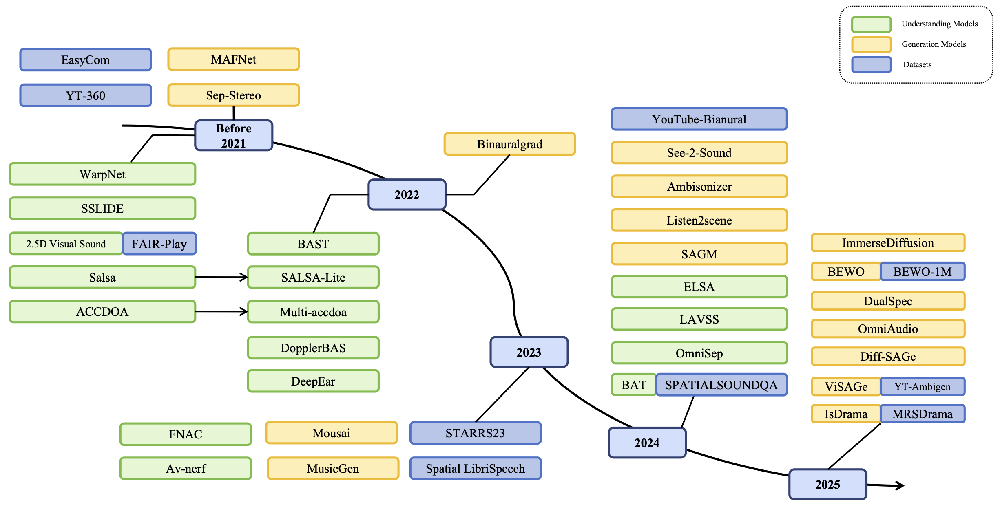
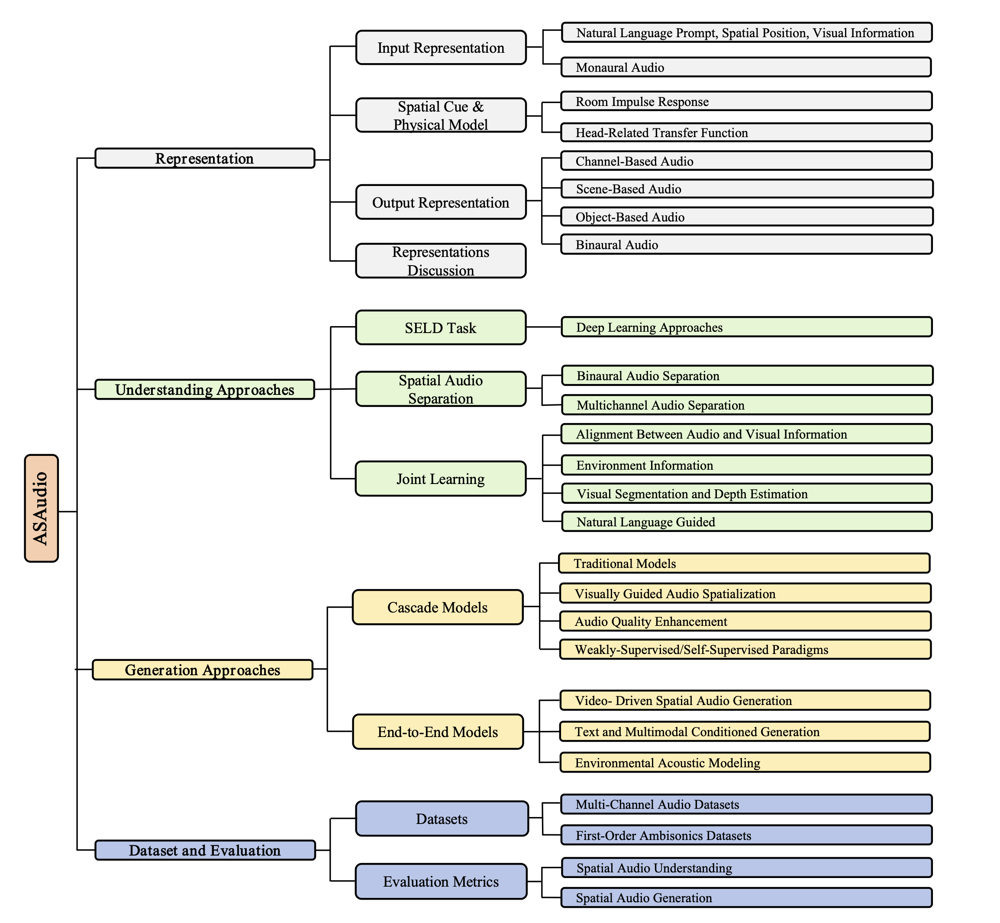
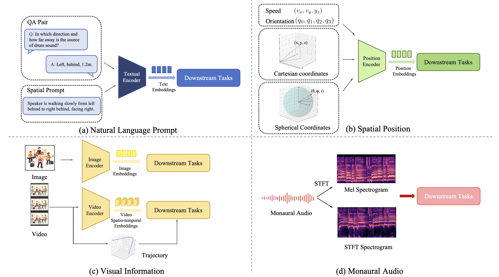

# ASAudio: A Survey of Advanced Spatial Audio Research

#### Zhiyuan Zhu*, Yu Zhang*, Wenxiang Guo, Changhao Pan, Zhou Zhao | Zhejiang University

Resource list of [ASAudio](https://arxiv.org/abs/2508.10924): A Survey of Advanced Spatial Audio Research.

[](https://arxiv.org/abs/2508.10924)
[](https://github.com/dieKarotte/ASAudio)

We introduce ASAudio, a comprehensive survey covering the representations, understanding tasks, and generation tasks in spatial audio, as well as the relevant datasets and evaluation metrics.

In this repository, we provide links to related papers and their corresponding code.

We hope this helps you appreciate the fascinating world of spatial audio!

## News

- 2025.8.24: The survey is released on [arXiv](https://arxiv.org/abs/2508.10924).

 # 🚀Quick Start 

- [ASAudio: A Survey of Advanced Spatial Audio Research](#asaudio-a-survey-of-advanced-spatial-audio-research)
      - [Zhiyuan Zhu\*, Yu Zhang\*, Wenxiang Guo, Changhao Pan, Zhou Zhao | Zhejiang University](#zhiyuan-zhu-yu-zhang-wenxiang-guo-changhao-pan-zhou-zhao--zhejiang-university)
  - [News](#news)
- [🚀Quick Start](#quick-start)
  - [Introduction](#introduction)
  - [Overall](#overall)
  - [Representations of Spatial Audio](#representations-of-spatial-audio)
      - [1. Input Representations](#1-input-representations)
      - [2. Spatial Cues and Physical Modeling](#2-spatial-cues-and-physical-modeling)
          - [2.1 Room Impulse Response (RIR)](#21-room-impulse-response-rir)
          - [2.2 Head Related Transfer Function (HRTF)](#22-head-related-transfer-function-hrtf)
      - [3. Output Representations](#3-output-representations)
  - [4. Spatial Audio Understanding Models](#4-spatial-audio-understanding-models)
      - [4.1 SELD Papers](#41-seld-papers)
      - [4.2 Spatial Audio Separation Papers](#42-spatial-audio-separation-papers)
      - [4.3 Joint Learning Papers](#43-joint-learning-papers)
  - [5. Spatial Audio Generation Models](#5-spatial-audio-generation-models)
  - [6. Spatial Audio Datasets](#6-spatial-audio-datasets)
  - [Citations](#citations)

## Introduction

This repository is the official repository of the **ASAudio: A Survey of Advanced Spatial Audio Research**.

<div align='center'>


Figure 1: The timeline of spatial audio models & datasets in recent years.
</div>

> Abstract
>
> With the rapid development of spatial audio technologies today, applications in AR, VR and other scenarios have garnered extensive attention. Unlike traditional mono sound, spatial audio offers a more realistic and immersive auditory experience. Despite notable progress in the field, there remains a lack of comprehensive surveys that systematically organize and analyze these methods and their underlying technologies. In this paper, we provide a comprehensive overview of spatial audio and systematically review recent literature in the area. To address this, we chronologically outline existing work related to spatial audio and categorize these studies based on input-output representations, as well as generation and understanding tasks, thereby summarizing various research aspects of spatial audio. In addition, we review related datasets, evaluation metrics, and benchmarks, offering insights from both training and evaluation perspectives. 

## Overall

<div align='center'>



Figure 2: Orgnization of this survey.
</div>

## Representations of Spatial Audio

#### 1. Input Representations

| Attribute         | Natural Language                      | Spatial Position                | Visual Information                | Monaural Audio                   |
|:-:|:-:|:-:|:-:|:-:|
| Primary Info      | Semantic, relational, implicit spatial| Explicit spatial, dynamic       | Semantic, spatial, dynamic        | Acoustic (timbre, pitch, content)|
| Control Precision | Low                                  | Very high                       | High                              | N/A                              |
| Abstraction Level | High                                 | Low                             | High                              | Low                              |
| Interpretability  | Indirect                             | Direct                          | Indirect                          | Indirect                         |
| Key Challenges    | Ambiguity; semantic–signal gap        | No semantics; tedious authoring | Ambiguity; occlusion; compute cost| Lack of spatial cues             |

<div align='center'>
Table 1: Comparative analysis of spatial audio input representations
</div>

<div align='center'>

Figure 1: The input representations and their fundamental processing steps.
</div>


#### 2. Spatial Cues and Physical Modeling

###### 2.1 Room Impulse Response (RIR)
<div align='center'>
<table style="width: 100%; table-layout: fixed;">
    <colgroup>
       <col span="1" style="width: 68%;">
       <col span="1" style="width: 17%;">
       <col span="1" style="width: 15%;">
    </colgroup>
    <thead>
        <tr>
            <th> Paper </th>
            <th> URL </th>
            <th> Code/Dataset </th>
        </tr>
    </thead>
    <tbody>
        <tr>
            <td style="overflow-wrap: break-word; hyphens: auto;" lang="en">Few-shot audio-visual learning of environment acoustics</td>
            <td valign="middle">
            <a href="https://arxiv.org/abs/2206.04006"></a>
            </td>
            <td valign="middle">
            <a href="https://github.com/SAGNIKMJR/few-shot-rir"></a>
            </td>
        </tr>
        <tr>
            <td style="overflow-wrap: break-word; hyphens: auto;" lang="en">Spatial scaper: a library to simulate and augment soundscapes for sound event localization and detection in realistic rooms</td>
            <td valign="middle">
            <a href="https://arxiv.org/abs/2401.12238"></a>
            </td>
            <td valign="middle">
            <a href="https://github.com/marl/SpatialScaper"></a>
            </td>
        </tr>
        <tr>
            <td style="overflow-wrap: break-word; hyphens: auto;" lang="en">Novel-view acoustic synthesis from 3D reconstructed rooms</td>
            <td valign="middle">
            <a href="https://arxiv.org/abs/2310.15130"></a>
            </td>
            <td valign="middle">
            <a href="https://github.com/apple/ml-nvas3d"></a>
            </td>
        </tr>
        <tr>
            <td style="overflow-wrap: break-word; hyphens: auto;" lang="en">A binaural room impulse response database for the evaluation of dereverberation algorithms</td>
            <td valign="middle">
            <a href="https://ieeexplore.ieee.org/document/5201259"></a>
            </td>
            <td valign="middle">
            <a href="https://www.mathworks.com/matlabcentral/fileexchange/29073-air-database"></a>
            </td>
        </tr>
        <tr>
            <td style="overflow-wrap: break-word; hyphens: auto;" lang="en">The Sweet-Home speech and multimodal corpus for home automation interaction</td>
            <td valign="middle">
            <a href="https://www.researchgate.net/publication/280751765_The_Sweet-Home_speech_and_multimodal_corpus_for_home_automation_interaction"></a></td>
            <td style="text-align: center;">-</td>
        </tr>
        <tr>
            <td style="overflow-wrap: break-word; hyphens: auto;" lang="en">Dataset of Binaural Room Impulse Responses at Multiple Recording Positions, Source Positions, and Orientations in a Real Room</td>
            <td valign="middle">
            <a href="https://pub.dega-akustik.de/DAGA_2017/data/articles/000359.pdf">
            
            </a>
            </td>
           <td style="text-align: center;">-</td> 
        </tr>
        <tr>
            <td style="overflow-wrap: break-word; hyphens: auto;" lang="en">dEchorate: a calibrated room impulse response database for echo-aware signal processing</td>
            <td valign="middle">
            <a href="https://arxiv.org/abs/2104.13168"></a>
            </td>
            <td valign="middle">
            <a href="https://github.com/Chutlhu/dEchorate"></a>
            </td>
        </tr>
        <tr>
            <td style="overflow-wrap: break-word; hyphens: auto;" lang="en">BIRD: Big impulse response dataset</td>
            <td valign="middle">
            <a href="https://arxiv.org/abs/2010.09930"></a>
            </td>
            <td valign="middle">
            <a href="https://github.com/FrancoisGrondin/BIRD"></a>
            </td>
        </tr>
       <tr>
            <td style="overflow-wrap: break-word; hyphens: auto;" lang="en">Visually informed binaural audio generation without binaural audios</td>
            <td valign="middle">
            <a href="https://arxiv.org/abs/2104.06162"></a>
            </td>
            <td valign="middle">
            <a href="https://github.com/SheldonTsui/PseudoBinaural_CVPR2021"></a>
            </td>
        </tr>
        <tr>
            <td style="overflow-wrap: break-word; hyphens: auto;" lang="en">MeshRIR: A dataset of room impulse responses on meshed grid points for evaluating sound field analysis and synthesis methods</td>
            <td valign="middle">
            <a href="https://arxiv.org/abs/2106.10801"></a>
            </td>
            <td valign="middle">
            <a href="https://github.com/sh01k/MeshRIR"></a>
            </td>
        </tr>
        <tr>
            <td style="overflow-wrap: break-word; hyphens: auto;" lang="en">Mesh2ir: Neural acoustic impulse response generator for complex 3d scenes</td>
            <td valign="middle">
            <a href="https://arxiv.org/abs/2205.09248"></a>
            </td>
            <td valign="middle">
            <a href="https://github.com/anton-jeran/MESH2IR"></a>
            </td>
        </tr>
        <tr>
            <td style="overflow-wrap: break-word; hyphens: auto;" lang="en">A dataset of reverberant spatial sound scenes with moving sources for sound event localization and detection</td>
            <td valign="middle">
            <a href="https://arxiv.org/abs/2006.01919"></a>
            </td>
            <td valign="middle">
            <a href="https://dcase-repo.github.io/dcase_datalist/datasets/sounds/tau_nigens_spatial_events_2020.html">
            
            </a>
            </td>
        </tr>
       <tr>
            <td style="overflow-wrap: break-word; hyphens: auto;" lang="en">Acoustic analysis and dataset of transitions between coupled rooms</td>
            <td valign="middle">
                <a href="https://ieeexplore.ieee.org/document/9415122/"></a>
            </td>
            <td style="text-align: center;">-</td>
        </tr>
        <tr>
            <td style="overflow-wrap: break-word; hyphens: auto;" lang="en">Dataset of spatial room impulse responses in a variable acoustics room for six degrees-of-freedom rendering and analysis</td>
            <td valign="middle">
            <a href="https://arxiv.org/abs/2111.11882"></a>
            </td>
            <td valign="middle">
                <a href="https://zenodo.org/records/6382405">
                
                </a>
            </td>
        </tr>
        <tr>
            <td style="overflow-wrap: break-word; hyphens: auto;" lang="en">On the authenticity of individual dynamic binaural synthesis</td>
            <td valign="middle">
                <a href="https://pubs.aip.org/asa/jasa/article/142/4/1784/853094">
                
                </a>
            </td>
            <td style="text-align: center;">-</td>
        </tr>
    </tbody>
</table>
Table 2: The list of RIR papers and their URL
</div>  


###### 2.2 Head Related Transfer Function (HRTF)

<div align='center'>
<table style="width: 100%; table-layout: fixed;">
    <colgroup>
       <col span="1" style="width: 68%;">
       <col span="1" style="width: 17%;">
       <col span="1" style="width: 15%;">
    </colgroup>
    <thead>
        <tr>
            <th> Paper </th>
            <th> URL </th>
            <th> Code/Dataset </th>
        </tr>
    </thead>
    <tbody>
        <tr>
            <td style="overflow-wrap: break-word; hyphens: auto;" lang="en">HRTF personalization based on ear morphology</td>
            <td valign="middle">
            <a href="https://research.facebook.com/publications/hrtf-personalization-based-on-ear-morphology/">
            
            </a>
            </td>
            <td style="text-align: center;">-</td>
        </tr>
        <tr>
            <td style="overflow-wrap: break-word; hyphens: auto;" lang="en">On HRTF Notch Frequency Prediction using Anthropometric Features and Neural Networks</td>
            <td valign="middle">
            <a href="https://arxiv.org/abs/2403.07579"></a>
            </td>
            <td style="text-align: center;">-</td>
        </tr>
        <tr>
            <td style="overflow-wrap: break-word; hyphens: auto;" lang="en">Magnitude modeling of personalized HRTF based on ear images and anthropometric measurements</td>
            <td valign="middle">
                <a href="https://www.mdpi.com/2076-3417/12/16/8155">
                
                </a>
            </td>
            <td style="text-align: center;">-</td>
        </tr>
        <tr>
            <td style="overflow-wrap: break-word; hyphens: auto;" lang="en">Global HRTF interpolation via learned affine transformation of hyper-conditioned features</td>
            <td valign="middle">
            <a href="https://arxiv.org/abs/2204.02637"></a>
            </td>
            <td valign="middle">
            <a href="https://github.com/jin-woo-lee/hrtf-interpolation"></a>
            </td>
        </tr>
        <tr>
            <td style="overflow-wrap: break-word; hyphens: auto;" lang="en">HRTF recommendation based on the predicted binaural colouration model</td>
            <td valign="middle">
        <a href="https://ieeexplore.ieee.org/document/10448092"></a>
    </td>
            <td style="text-align: center;">-</td>
        </tr>
        <tr>
            <td style="overflow-wrap: break-word; hyphens: auto;" lang="en">Modeling individual head-related transfer functions from sparse measurements using a convolutional neural network</td>
            <td valign="middle">
                <a href="https://www.researchgate.net/publication/368757656_Modelling_individual_head-related_transfer_function_HRTF_based_on_anthropometric_parameters_and_generic_HRTF_amplitudes">
                
                </a>
            </td>
           <td style="text-align: center;">-</td> 
        </tr>
        <tr>
            <td style="overflow-wrap: break-word; hyphens: auto;" lang="en">Head-related transfer function interpolation from spatially sparse measurements using autoencoder with source position conditioning</td>
            <td valign="middle">
            <a href="https://arxiv.org/abs/2207.10967"></a>
            </td>
            <td valign="middle">
            <a href="https://github.com/ikets/HRTFInterpAE_public"></a>
            </td>
        </tr>
        <tr>
            <td style="overflow-wrap: break-word; hyphens: auto;" lang="en">HRTF upsampling with a generative adversarial network using a gnomonic equiangular projection</td>
            <td valign="middle">
            <a href="https://arxiv.org/abs/2306.05812"></a>
            </td>
            <td valign="middle">
            <a href="https://github.com/ahogg/HRTF-upsampling-with-a-generative-adversarial-network-using-a-gnomonic-equiangular-projection"></a>
            </td>
        </tr>
       <tr>
            <td style="overflow-wrap: break-word; hyphens: auto;" lang="en">Spatial upsampling of head-related transfer functions using a physics-informed neural network</td>
            <td valign="middle">
            <a href="https://arxiv.org/abs/2307.14650"></a>
            </td>
            <td valign="middle">
            <a href="https://github.com/feima1024/PINN-for-HRTF-upsampling"></a>
            </td>
        </tr>
        <tr>
            <td style="overflow-wrap: break-word; hyphens: auto;" lang="en">HRTF field: Unifying measured HRTF magnitude representation with neural fields</td>
            <td valign="middle">
            <a href="https://arxiv.org/abs/2210.15196"></a>
            </td>
            <td valign="middle">
            <a href="https://github.com/yzyouzhang/HRTF_field"></a>
            </td>
        </tr>
        <tr>
            <td style="overflow-wrap: break-word; hyphens: auto;" lang="en">Head-related transfer function interpolation with a spherical CNN</td>
            <td valign="middle">
            <a href="https://arxiv.org/abs/2309.08290"></a>
            </td>
            <td valign="middle">
            <a href="https://github.com/xingyuaudio"></a>
            </td>
        </tr>
        <tr>
            <td style="overflow-wrap: break-word; hyphens: auto;" lang="en">HRTF interpolation using a spherical neural process meta-learner</td>
            <td valign="middle">
            <a href="https://arxiv.org/abs/2310.13430"></a>
            </td>
            <td style="text-align: center;">-</td>
        </tr>
        <tr>
            <td style="overflow-wrap: break-word; hyphens: auto;" lang="en">NIIRF: Neural IIR Filter Field for HRTF Upsampling and Personalization</td>
            <td valign="middle">
            <a href="https://arxiv.org/abs/2402.17907"></a>
            </td>
            <td valign="middle">
            <a href="https://github.com/merlresearch/neural-IIR-field"></a>
            </td>
        </tr>
    </tbody>
</table>
Table 3: The list of HRTF papers and their URL
</div>

#### 3. Output Representations

| Attribute  | Channel-Based | Scene-Based | Object-Based     |
|:-:|:-:|:-:|:-:|
| Freedom of Listening Position| Limited | High| Moderate  |
| Playback System Dependency | Very high  | High| Low    |
| Scalability| Low | Moderate | Excellent |
| Playback-End Complexity | Low | High| Moderate |
| **Common Formats** | Stereo; 5.1/7.1 surround | Ambisonics; wave-field synthesis (WFS)| Dolby Atmos; DTS:X; MPEG-H 3D Audio|
<div align='center'>
Table 4: Comparative analysis of spatial audio output representations
</div>

## 4. Spatial Audio Understanding Models

#### 4.1 SELD Papers
<div align="center">
 <table style="width: 100%; table-layout: fixed;">
  <colgroup>
   <col span="1" style="width: 68%;">
   <col span="1" style="width: 17%;">
   <col span="1" style="width: 15%;">
  </colgroup>
  <thead>
   <tr>
    <th style="text-align: center;">
     Paper
    </th>
    <th style="text-align: center;">
     URL
    </th>
    <th style="text-align: center;">
     Code
    </th>
   </tr>
  </thead>
  <tbody>
   <tr>
    <td lang="en" style="overflow-wrap: break-word; hyphens: auto;">
     Learning to localize sound source in visual scenes
    </td>
    <td valign="middle">
            <a href="https://arxiv.org/abs/1803.03849"></a>
            </td>
    <td valign="middle">
            <a href="https://github.com/ardasnck/learning_to_localize_sound_source"></a>
            </td>
   </tr>
   <tr>
    <td lang="en" style="overflow-wrap: break-word; hyphens: auto;">
     Learning Audio-Visual Source Localization via False Negative Aware Contrastive Learning
    </td>
    <td valign="middle">
            <a href="https://arxiv.org/abs/2303.11302"></a>
            </td>
    <td valign="middle">
            <a href="https://github.com/OpenNLPLab/FNAC_AVL"></a>
            </td>
   </tr>
   <tr>
    <td lang="en" style="overflow-wrap: break-word; hyphens: auto;">
     Classification of spatial audio location and content using convolutional neural networks
    </td>
    <td valign="middle">
    <a href="https://www.researchgate.net/publication/276061831_Classification_of_Spatial_Audio_Location_and_Content_Using_Convolutional_Neural_Networks">
    
    </a>
    </td>
      <center>
       Link
      </center>
     </a>
    </td>
    <td valign="middle"><center>
       -
      </center>
     </td>
    </td>
   </tr>
   <tr>
    <td lang="en" style="overflow-wrap: break-word; hyphens: auto;">
     An improved event-independent network for polyphonic sound event localization and detection
    </td>
    <td valign="middle">
            <a href="https://arxiv.org/abs/2010.13092"></a>
            </td>
    <td valign="middle">
            <a href="https://github.com/yinkalario/EIN-SELD"></a>
            </td>
   </tr>
   <tr>
    <td lang="en" style="overflow-wrap: break-word; hyphens: auto;">
     Sound event localization and detection of overlapping sources using convolutional recurrent neural networks
    </td>
    <td valign="middle">
            <a href="https://arxiv.org/abs/1807.00129"></a>
            </td>
    <td valign="middle">
            <a href="https://github.com/sharathadavanne/seld-net"></a>
            </td>
   </tr>
   <tr>
    <td lang="en" style="overflow-wrap: break-word; hyphens: auto;">
     Salsa: Spatial cue-augmented log-spectrogram features for polyphonic sound event localization and detection
    </td>
    <td valign="middle">
            <a href="https://arxiv.org/abs/2110.00275"></a>
            </td>
    <td valign="middle">
            <a href="https://github.com/thomeou/SALSA"></a>
            </td>
   </tr>
   <tr>
    <td lang="en" style="overflow-wrap: break-word; hyphens: auto;">
     Multi-accdoa: Localizing and detecting overlapping sounds from the same class with auxiliary duplicating permutation invariant training
    </td>
    <td valign="middle">
            <a href="https://arxiv.org/abs/2110.07124"></a>
            </td>
    <td style="text-align: center;">
     -
    </td>
   </tr>
   <tr>
    <td lang="en" style="overflow-wrap: break-word; hyphens: auto;">
     Sound event localization based on sound intensity vector refined by DNN-based denoising and source separation
    </td>
    <td valign="middle">
            <a href="https://arxiv.org/abs/2002.05994"></a>
            </td>
    <td style="text-align: center;">
     -
    </td>
   </tr>
   <tr>
    <td lang="en" style="overflow-wrap: break-word; hyphens: auto;">
     Binaural source localization using deep learning and head rotation information
    </td>
    <td valign="middle">
            <a href="https://ieeexplore.ieee.org/document/9909764"></a>
            </td>
    <td style="text-align: center;">
     -
    </td>
   </tr>
   <tr>
    <td lang="en" style="overflow-wrap: break-word; hyphens: auto;">
     A sequence matching network for polyphonic sound event localization and detection
    </td>
    <td valign="middle">
            <a href="https://ieeexplore.ieee.org/document/9053045"></a>
            </td>
    <td style="text-align: center;">
     -
    </td>
   </tr>
   <tr>
    <td lang="en" style="overflow-wrap: break-word; hyphens: auto;">
     ACCDOA: Activity-coupled cartesian direction of arrival representation for sound event localization and detection
    </td>
    <td valign="middle">
            <a href="https://arxiv.org/abs/2010.15306"></a>
            </td>
    <td style="text-align: center;">
     -
    </td>
   </tr>
   <tr>
    <td lang="en" style="overflow-wrap: break-word; hyphens: auto;">
     Binaural sound source distance estimation and localization for a moving listener
    </td>
    <td valign="middle">
            <a href="https://ieeexplore.ieee.org/document/10372100"></a>
            </td>
    <td valign="middle">
            <a href="https://github.com/danielkrause/Moving-Binaural-SDEL"></a>
            </td>
   </tr>
   <tr>
    <td lang="en" style="overflow-wrap: break-word; hyphens: auto;">
     Audio-visual event localization in unconstrained videos
    </td>
    <td valign="middle">
            <a href="https://arxiv.org/abs/1803.08842"></a>
            </td>
    <td style="text-align: center;">
     -
    </td>
   </tr>
   <tr>
    <td lang="en" style="overflow-wrap: break-word; hyphens: auto;">
     w2v-SELD: A Sound Event Localization and Detection Framework for Self-Supervised Spatial Audio Pre-Training
    </td>
    <td valign="middle">
            <a href="https://arxiv.org/abs/2312.06907"></a>
            </td>
    <td valign="middle">
            <a href="https://github.com/Orlllem/seld_wav2vec2"></a>
            </td>
   </tr>
   <tr>
    <td lang="en" style="overflow-wrap: break-word; hyphens: auto;">
     BAST: Binaural audio spectrogram transformer for binaural sound localization
    </td>
    <td valign="middle">
            <a href="https://arxiv.org/abs/2207.03927"></a>
            </td>
    <td valign="middle">
            <a href="https://github.com/ShengKuangCN/BAST"></a>
            </td>
   </tr>
   <tr>
    <td lang="en" style="overflow-wrap: break-word; hyphens: auto;">
     A time-domain unsupervised learning based sound source localization method
    </td>
    <td valign="middle">
            <a href="https://ieeexplore.ieee.org/document/9232117"></a>
            </td>
    <td style="text-align: center;">
     -
    </td>
   </tr>
   <tr>
    <td lang="en" style="overflow-wrap: break-word; hyphens: auto;">
     Sslide: Sound source localization for indoors based on deep learning
    </td>
    <td valign="middle">
            <a href="https://arxiv.org/abs/2010.14420"></a>
            </td>
    <td style="text-align: center;">
     -
    </td>
   </tr>
   <tr>
    <td lang="en" style="overflow-wrap: break-word; hyphens: auto;">
     Semi-supervised source localization with deep generative modeling
    </td>
    <td valign="middle">
            <a href="https://arxiv.org/abs/2005.13163"></a>
            </td>
    <td style="text-align: center;">
     -
    </td>
   </tr>
   <tr>
    <td lang="en" style="overflow-wrap: break-word; hyphens: auto;">
     Semi-supervised source localization in reverberant environments with deep generative modeling
    </td>
    <td valign="middle">
            <a href="https://ieeexplore.ieee.org/document/9449880"></a>
            </td>
    <td style="text-align: center;">
     -
    </td>
   </tr>
   <tr>
    <td lang="en" style="overflow-wrap: break-word; hyphens: auto;">
     Joint measurement of localization and detection of sound events
    </td>
    <td valign="middle">
            <a href="https://ieeexplore.ieee.org/document/8937220"></a>
            </td>
    <td valign="middle">
            <a href="https://github.com/sharathadavanne/seld-metric"></a>
            </td>
   </tr>
   <tr>
    <td lang="en" style="overflow-wrap: break-word; hyphens: auto;">
     3D localization of multiple sound sources with intensity vector estimates in single source zones
    </td>
    <td valign="middle">
            <a href="https://ieeexplore.ieee.org/document/7362645"></a>
            </td>
    <td style="text-align: center;">
     -
    </td>
   </tr>
   <tr>
    <td lang="en" style="overflow-wrap: break-word; hyphens: auto;">
     Self-supervised moving vehicle tracking with stereo sound
    </td>
    <td valign="middle">
            <a href="https://arxiv.org/abs/1910.11760"></a>
            </td>
    <td style="text-align: center;">
     -
    </td>
   </tr>
   <tr>
    <td lang="en" style="overflow-wrap: break-word; hyphens: auto;">
     A probabilistic model for robust localization based on a binaural auditory front-end
    </td>
    <td valign="middle">
            <a href="https://ieeexplore.ieee.org/document/5406118"></a>
            </td>
    <td style="text-align: center;">
     -
    </td>
   </tr>
   <tr>
    <td lang="en" style="overflow-wrap: break-word; hyphens: auto;">
     Deepear: Sound localization with binaural microphones
    </td>
    <td valign="middle">
            <a href="https://ieeexplore.ieee.org/document/9954178"></a>
            </td>
    <td style="text-align: center;">
     -
    </td>
   </tr>
   <tr>
    <td lang="en" style="overflow-wrap: break-word; hyphens: auto;">
     Towards generating ambisonics using audio-visual cue for virtual reality
    </td>
    <td valign="middle">
            <a href="https://ieeexplore.ieee.org/document/8683318"></a>
            </td>
    <td valign="middle">
            <a href="https://github.com/V-Sense/360AudioVisual"></a>
            </td>
   </tr>
   <tr>
    <td lang="en" style="overflow-wrap: break-word; hyphens: auto;">
     AD-YOLO: You look only once in training multiple sound event localization and detection
    </td>
    <td valign="middle">
            <a href="https://arxiv.org/abs/2303.15703"></a>
            </td>
    <td style="text-align: center;">
     -
    </td>
   </tr>
   <tr>
    <td lang="en" style="overflow-wrap: break-word; hyphens: auto;">
     Polyphonic Sound Event Detection and Localization using a Two-Stage Strategy
    </td>
    <td valign="middle">
            <a href="https://arxiv.org/abs/1905.00268"></a>
            </td>
    <td valign="middle">
            <a href="https://github.com/yinkalario/Two-Stage-Polyphonic-Sound-Event-Detection-and-Localization"></a>
            </td>
   </tr>
   <tr>
    <td lang="en" style="overflow-wrap: break-word; hyphens: auto;">
     Sound event localization and detection using squeeze-excitation residual CNNs
    </td>
    <td valign="middle">
            <a href="https://arxiv.org/abs/2006.14436"></a>
            </td>
    <td valign="middle">
            <a href="https://github.com/janaal1/DCASE2020-Task3"></a>
            </td>
   </tr>
  </tbody>
 </table>
 Table 5: The list of SELD Papers and their URL
</div>


#### 4.2 Spatial Audio Separation Papers
<div align="center">
 <table style="width: 100%; table-layout: fixed;">
  <colgroup>
   <col span="1" style="width: 68%;">
   <col span="1" style="width: 17%;">
   <col span="1" style="width: 15%;">
  </colgroup>
  <thead>
   <tr>
    <th style="text-align: center;">
     Paper
    </th>
    <th style="text-align: center;">
     URL
    </th>
    <th style="text-align: center;">
     Code
    </th>
   </tr>
  </thead>
  <tbody>
   <tr>
    <td lang="en" style="overflow-wrap: break-word; hyphens: auto;">
     Multi-channel deep clustering: Discriminative spectral and spatial embeddings for speaker-independent speech separation
    </td>
    <td valign="middle">
            <a href="https://ieeexplore.ieee.org/document/8461639"></a>
            </td>
    <td style="text-align: center;">
     -
    </td>
   </tr>
   <tr>
    <td lang="en" style="overflow-wrap: break-word; hyphens: auto;">
     Beamforming techniques for multichannel audio signal separation
    </td>
    <td valign="middle">
            <a href="https://arxiv.org/abs/1212.6080"></a>
            </td>
    <td style="text-align: center;">
     -
    </td>
   </tr>
   <tr>
    <td lang="en" style="overflow-wrap: break-word; hyphens: auto;">
     Deep learning based binaural speech separation in reverberant environments
    </td>
    <td valign="middle">
            <a href="https://ieeexplore.ieee.org/document/7886357"></a>
            </td>
    <td style="text-align: center;">
     -
    </td>
   </tr>
   <tr>
    <td lang="en" style="overflow-wrap: break-word; hyphens: auto;">
     Source separation based on binaural cues and source model constraints
    </td>
    <td valign="middle">
        <a href="https://www.ee.columbia.edu/~dpwe/pubs/WeissME08-MESSL-SP.pdf">
        
        </a>
    </td>
    <td style="text-align: center;">
     -
    </td>
   </tr>
   <tr>
    <td lang="en" style="overflow-wrap: break-word; hyphens: auto;">
     Combining spectral and spatial features for deep learning based blind speaker separation
    </td>
    <td valign="middle">
        <a href="https://ieeexplore.ieee.org/document/8540037">
        </a>
    </td>
    <td style="text-align: center;">
     -
    </td>
   </tr>
   <tr>
    <td lang="en" style="overflow-wrap: break-word; hyphens: auto;">
     Real-time binaural speech separation with preserved spatial cues
    </td>
    <td valign="middle">
        <a href="https://arxiv.org/pdf/2002.06637"></a>
    </td>
    <td style="text-align: center;">
     -
    </td>
   </tr>
   <tr>
    <td lang="en" style="overflow-wrap: break-word; hyphens: auto;">
     2.5 d visual sound
    </td>
    <td valign="middle">
        <a href="https://arxiv.org/abs/1812.04204"></a>
    </td>
    <td valign="middle">
            <a href="https://github.com/facebookresearch/2.5D-Visual-Sound"></a>
            </td>
   </tr>
   <tr>
    <td lang="en" style="overflow-wrap: break-word; hyphens: auto;">
     Lavss: Location-guided audio-visual spatial audio separation
    </td>
    <td valign="middle">
            <a href="https://arxiv.org/abs/2310.20446"></a>
            </td>
    <td valign="middle">
            <a href="https://github.com/YYX666660/LAVSS"></a>
            </td>
   </tr>
   <tr>
    <td lang="en" style="overflow-wrap: break-word; hyphens: auto;">
     The cocktail party robot: Sound source separation and localisation with an active binaural head
    </td>
    <td valign="middle">
            <a href="https://ieeexplore.ieee.org/document/6249602"></a>
            </td>
    <td style="text-align: center;">
     -
    </td>
   </tr>
   <tr>
    <td lang="en" style="overflow-wrap: break-word; hyphens: auto;">
     The sound of pixels
    </td>
    <td valign="middle">
            <a href="https://arxiv.org/abs/1804.03160"></a>
            </td>
    <td valign="middle">
            <a href="https://github.com/hangzhaomit/Sound-of-Pixels"></a>
            </td>
   </tr>
   <tr>
    <td lang="en" style="overflow-wrap: break-word; hyphens: auto;">
     Self-supervised generation of spatial audio for 360 video
    </td>
    <td valign="middle">
            <a href="https://arxiv.org/abs/1809.02587"></a>
            </td>
    <td valign="middle">
            <a href="https://github.com/pedro-morgado/spatialaudiogen"></a>
            </td>
   </tr>
   <tr>
    <td lang="en" style="overflow-wrap: break-word; hyphens: auto;">
     Multichannel audio source separation with deep neural networks
    </td>
    <td valign="middle">
        <a href="https://arxiv.org/abs/2109.00704"></a>
    </td>
    <td style="text-align: center;">
     -
    </td>
   </tr>
   <tr>
    <td lang="en" style="overflow-wrap: break-word; hyphens: auto;">
     Blind and neural network-guided convolutional beamformer for joint denoising, dereverberation, and source separation
    </td>
    <td valign="middle">
            <a href="https://ieeexplore.ieee.org/document/9414264"></a>
            </td>
    <td style="text-align: center;">
     -
    </td>
   </tr>
   <tr>
    <td lang="en" style="overflow-wrap: break-word; hyphens: auto;">
     Multi-microphone neural speech separation for far-field multi-talker speech recognition
    </td>
    <td valign="middle">
            <a href="https://ieeexplore.ieee.org/document/8462081"></a>
            </td>
    <td style="text-align: center;">
     -
    </td>
   </tr>
   <tr>
    <td lang="en" style="overflow-wrap: break-word; hyphens: auto;">
     Unsupervised Bayesian Surprise Detection in Spatial Audio with Convolutional Variational Autoencoder and LSTM Model
    </td>
    <td valign="middle">
        <a href="https://dl.acm.org/doi/10.1145/3672406.3672422">
        
        </a>
    </td>
    <td style="text-align: center;">
     -
    </td>
   </tr>
   <tr>
    <td lang="en" style="overflow-wrap: break-word; hyphens: auto;">
     Integration of variational autoencoder and spatial clustering for adaptive multi-channel neural speech separation
    </td>
    <td valign="middle">
        <a href="http://arxiv.org/abs/2011.11984"></a>
    </td>
    <td valign="middle">
            <a href="https://github.com/BUTSpeechFIT/vae_dolphin"></a>
            </td>
   </tr>
  </tbody>
 </table>
 Table 6: The list of Spatial Audio Separation Papers and their URL
</div>


#### 4.3 Joint Learning Papers

<div align='center'>
<table style="width: 100%; table-layout: fixed;">
    <colgroup>
       <col span="1" style="width: 73%;">
       <col span="1" style="width: 12%;">
       <col span="1" style="width: 15%;">
    </colgroup>
    <thead>
        <tr>
            <th style="text-align: center;"> Paper </th>
            <th style="text-align: center;"> URL </th>
            <th style="text-align: center;"> Code </th>
        </tr>
    </thead>
    <tbody>
        <tr>
            <td style="overflow-wrap: break-word; hyphens: auto;" lang="en">Learning representations from audio-visual spatial alignment</td>
            <td valign="middle">
            <a href="https://arxiv.org/abs/2011.01819"></a>
            </td>
            <td valign="middle"><center>-</center></td>
        </tr>
        <tr>
            <td style="overflow-wrap: break-word; hyphens: auto;" lang="en">Telling left from right: Learning spatial correspondence of sight and sound</td>
            <td valign="middle">
            <a href="https://arxiv.org/abs/2006.06175"></a>
            </td>
            <td valign="middle">
            <a href="https://github.com/karreny/telling-left-from-right/tree/master"></a>
            </td>
        </tr>
        <tr>
            <td style="overflow-wrap: break-word; hyphens: auto;" lang="en">Av-nerf: Learning neural fields for real-world audio-visual scene synthesis</td>
            <td valign="middle">
            <a href="https://arxiv.org/abs/2302.02088"></a>
            </td>
            <td valign="middle">
            <a href="https://github.com/liangsusan-git/AV-NeRF"></a>
            </td>
        </tr>
        <tr>
            <td style="overflow-wrap: break-word; hyphens: auto;" lang="en">Learning neural acoustic fields</td>
            <td valign="middle">
            <a href="https://arxiv.org/abs/2204.00628"></a>
            </td>
            <td valign="middle">
            <a href="https://github.com/aluo-x/Learning_Neural_Acoustic_Fields"></a>
            </td>
        </tr>
        <tr>
            <td style="overflow-wrap: break-word; hyphens: auto;" lang="en">Overview of geometrical room acoustic modeling techniques</td>
            <td valign="middle">
            <a href="https://pubs.aip.org/asa/jasa/article/138/2/708/917382/Overview-of-geometrical-room-acoustic-modeling">
            
            </a></td>
            <td style="text-align: center;">-</td>
        </tr>
        <tr>
            <td style="overflow-wrap: break-word; hyphens: auto;" lang="en">Av-rir: Audio-visual room impulse response estimation</td>
            <td valign="middle">
            <a href="https://arxiv.org/abs/2312.00834"></a>
            </td>
           <td valign="middle">
            <a href="https://github.com/anton-jeran/AV-RIR"></a>
            </td>
        </tr>
        <tr>
            <td style="overflow-wrap: break-word; hyphens: auto;" lang="en">Impulse response data augmentation and deep neural networks for blind room acoustic parameter estimation</td>
            <td valign="middle">
        <a href="https://ieeexplore.ieee.org/document/9052970/"></a>
    </td>
            <td style="text-align: center;">-</td>
        </tr>
       <tr>
            <td style="overflow-wrap: break-word; hyphens: auto;" lang="en">Multi-Channel Mosra: Mean Opinion Score and Room Acoustics Estimation Using Simulated Data and A Teacher Model</td>
            <td valign="middle">
            <a href="https://arxiv.org/abs/2309.11976"></a>
            </td>
            <td style="text-align: center;">-</td>
        </tr>
        <tr>
            <td style="overflow-wrap: break-word; hyphens: auto;" lang="en">Few-shot audio-visual learning of environment acoustics</td>
            <td valign="middle">
            <a href="https://arxiv.org/abs/2206.04006"></a>
            </td>
            <td valign="middle">
            <a href="https://github.com/SAGNIKMJR/few-shot-rir"></a>
            </td>
        </tr>
        <tr>
            <td style="overflow-wrap: break-word; hyphens: auto;" lang="en">Blind room parameter estimation using multiple multichannel speech recordings</td>
            <td valign="middle">
            <a href="https://arxiv.org/abs/2107.13832"></a>
            </td>
            <td valign="middle">
            <a href="https://github.com/prerak23/RoomParamEstim"></a>
            </td>
        </tr>
        <tr>
            <td style="overflow-wrap: break-word; hyphens: auto;" lang="en">Visual-based spatial audio generation system for multi-speaker environments</td>
            <td valign="middle">
            <a href="https://arxiv.org/abs/2502.07538"></a>
            </td>
            <td style="text-align: center;">-</td>
        </tr>
        <tr>
            <td style="overflow-wrap: break-word; hyphens: auto;" lang="en">Learning Spatially-Aware Language and Audio Embeddings</td>
            <td valign="middle">
            <a href="https://arxiv.org/abs/2409.11369"></a>
            </td>
            <td style="text-align: center;">-</td>
        </tr>
        <tr>
            <td style="overflow-wrap: break-word; hyphens: auto;" lang="en">BAT: Learning to Reason about Spatial Sounds with Large Language Models</td>
            <td valign="middle">
            <a href="https://arxiv.org/abs/2402.01591"></a>
            </td>
            <td valign="middle">
            <a href="https://github.com/zszheng147/Spatial-AST"></a>
            </td>
        </tr>
    </tbody>
</table>
Table 7: The list of Joint Learning Papers and their URL
</div>

## 5. Spatial Audio Generation Models
<div align="center">
 <table style="width: 100%; table-layout: fixed;">
  <colgroup>
   <col span="1" style="width: 68%;">
   <col span="1" style="width: 17%;">
   <col span="1" style="width: 15%;">
  </colgroup>
  <thead>
   <tr>
    <th style="text-align: center;">
     Paper
    </th>
    <th style="text-align: center;">
     URL
    </th>
    <th style="text-align: center;">
     Code
    </th>
   </tr>
  </thead>
  <tbody>
   <tr>
    <td style="word-break: break-all;">
     A structural model for binaural sound synthesis
    </td>
    <td valign="middle">
        <a href="https://ieeexplore.ieee.org/document/709673"></a>
    </td>
    <td style="text-align: center;">
     -
    </td>
    <tr>
     <td style="word-break: break-all;">
      Neural synthesis of binaural speech from mono audio
    <td valign="middle">
        <a href="https://openreview.net/forum?id=uAX8q61EVRu"></a>
    </td>
    <td valign="middle">
        <a href="https://github.com/facebookresearch/BinauralSpeechSynthesis"></a>
    </td>
    </tr>
    <tr>
     <td style="word-break: break-all;">
      2.5 d visual sound
     </td>
     <td valign="middle">
        <a href="https://arxiv.org/abs/1812.04204"></a>
    </td>
     <td valign="middle">
        <a href="https://github.com/facebookresearch/2.5D-Visual-Sound"></a>
    </td>
    </tr>
    <tr>
     <td style="word-break: break-all;">
      Cyclic Learning for Binaural Audio Generation and Localization
     </td>
     <td valign="middle">
        <a href="https://ieeexplore.ieee.org/document/10655301"></a>
    </td>
     <td style="text-align: center;">
      -
     </td>
    </tr>
    <tr>
     <td style="word-break: break-all;">
      Beyond mono to binaural: Generating binaural audio from mono audio with depth and cross modal attention
     </td>
     <td valign="middle">
            <a href="https://arxiv.org/abs/2111.08046"></a>
            </td>
     <td style="text-align: center;">
      -
     </td>
    </tr>
    <tr>
     <td style="word-break: break-all;">
      Geometry-aware multi-task learning for binaural audio generation from video
     </td>
     <td valign="middle">
            <a href="https://arxiv.org/abs/2111.10882"></a>
            </td>
     <td style="text-align: center;">
      -
     </td>
    </tr>
    <tr>
     <td style="word-break: break-all;">
      Multi-attention audio-visual fusion network for audio spatialization
     </td>
     <td valign="middle">
        <a href="https://dl.acm.org/doi/10.1145/3460426.3463624">
        
        </a>
    </td>
     <td style="text-align: center;">
      -
     </td>
    </tr>
    <tr>
     <td style="word-break: break-all;">
      Visually Guided Binaural Audio Generation with Cross-Modal Consistency
     </td>
     <td valign="middle">
        <a href="https://ieeexplore.ieee.org/document/10446399/"></a>
    </td>
     <td style="text-align: center;">
      -
     </td>
    </tr>
    <tr>
     <td style="word-break: break-all;">
      Interpretable binaural ratio for visually guided binaural audio generation
     </td>
     <td valign="middle">
        <a href="https://ieeexplore.ieee.org/document/9892951"></a>
    </td>
     <td style="text-align: center;">
      -
     </td>
    </tr>
    <tr>
     <td style="word-break: break-all;">
      Cross-modal generative model for visual-guided binaural stereo generation
     </td>
     <td valign="middle">
            <a href="https://arxiv.org/abs/2311.07630"></a>
            </td>
     <td style="text-align: center;">
      -
     </td>
    </tr>
    <tr>
     <td style="word-break: break-all;">
      Binauralgrad: A two-stage conditional diffusion probabilistic model for binaural audio synthesis
     </td>
     <td valign="middle">
            <a href="https://arxiv.org/abs/2205.14807"></a>
            </td>
     <td valign="middle">
            <a href="https://github.com/microsoft/NeuralSpeech/tree/master/BinauralGrad"></a>
            </td>
    </tr>
    <tr>
     <td style="word-break: break-all;">
      DopplerBAS: Binaural Audio Synthesis Addressing Doppler Effect
     </td>
     <td valign="middle">
            <a href="https://arxiv.org/abs/2212.07000"></a>
            </td>
     <td style="text-align: center;">
      -
     </td>
    </tr>
    <tr>
     <td style="word-break: break-all;">
      Neural fourier shift for binaural speech rendering
     </td>
     <td valign="middle">
            <a href="https://arxiv.org/abs/2211.00878"></a>
            </td>
     <td valign="middle">
            <a href="https://github.com/jin-woo-lee/nfs-binaural"></a>
            </td>
    </tr>
    <tr>
     <td style="word-break: break-all;">
      Visually informed binaural audio generation without binaural audios
     </td>
     <td valign="middle">
            <a href="https://arxiv.org/abs/2104.06162"></a>
            </td>
     <td valign="middle">
            <a href="https://github.com/SheldonTsui/PseudoBinaural_CVPR2021"></a>
            </td>
    </tr>
    <tr>
    <td style="word-break: break-all;">
      Localize to binauralize: Audio spatialization from visual sound source localization
    </td>
    <td valign="middle">
        <a href="https://ieeexplore.ieee.org/document/9711121"></a>
    </td>
     <td valign="middle">
            <a href="https://github.com/KranthiKumarR/Localize-to-Binauralize"></a>
            </td>
    </tr>
    <tr>
     <td style="word-break: break-all;">
      Sep-stereo: Visually guided stereophonic audio generation by associating source separation
     </td>
     <td valign="middle">
            <a href="https://arxiv.org/abs/2007.09902"></a>
            </td>
     <td valign="middle">
            <a href="https://github.com/SheldonTsui/SepStereo_ECCV2020"></a>
            </td>
    </tr>
    <tr>
     <td style="word-break: break-all;">
      Exploiting audio-visual consistency with partial supervision for spatial audio generation
     </td>
     <td valign="middle">
            <a href="https://arxiv.org/abs/2105.00708"></a>
            </td>
     <td style="text-align: center;">
      -
     </td>
    </tr>
    <tr>
     <td style="word-break: break-all;">
      Binaural audio generation via multi-task learning
     </td>
     <td valign="middle">
            <a href="https://arxiv.org/abs/2109.00748?utm_source=feedburner&amp;utm_medium=feed&amp;utm_campaign=Feed%3A+arxiv%2FQSXk+%28ExcitingAds%21+cs+updates+on+arXiv.org%29"></a>
            </td>
     <td valign="middle">
            <a href="https://github.com/omeaningless/binaural-audio-generation"></a>
            </td>
    </tr>
    <tr>
     <td style="word-break: break-all;">
      End-to-end binaural speech synthesis
     </td>
     <td valign="middle">
            <a href="https://arxiv.org/abs/2207.03697"></a>
            </td>
     <td style="text-align: center;">
      -
     </td>
    </tr>
    <tr>
     <td style="word-break: break-all;">
      Upmixing via style transfer: a variational autoencoder for disentangling spatial images and musical content
     </td>
     <td valign="middle">
            <a href="https://arxiv.org/abs/2203.12053"></a>
            </td>
     <td style="text-align: center;">
      -
     </td>
    </tr>
    <tr>
     <td style="word-break: break-all;">
      ViSAGe: Video-to-Spatial Audio Generation
     </td>
     <td valign="middle">
            <a href="https://arxiv.org/abs/2506.12199"></a>
            </td>
     <td valign="middle">
            <a href="https://github.com/jaeyeonkim99/visage"></a>
            </td>
    </tr>
    <tr>
     <td style="word-break: break-all;">
      OmniAudio: Generating Spatial Audio from 360-Degree Video
     </td>
     <td valign="middle">
            <a href="https://arxiv.org/abs/2504.14906"></a>
            </td>
     <td valign="middle">
            <a href="https://github.com/liuhuadai/OmniAudio"></a>
            </td>
    </tr>
    <tr>
     <td style="word-break: break-all;">
      Towards generating ambisonics using audio-visual cue for virtual reality
     </td>
     <td valign="middle">
        <a href="https://ieeexplore.ieee.org/document/8683318"></a></td>
     <td valign="middle">
            <a href="https://github.com/V-Sense/360AudioVisual"></a>
            </td>
    </tr>
    <tr>
     <td style="word-break: break-all;">
      Av-nerf: Learning neural fields for real-world audio-visual scene synthesis
     </td>
     <td valign="middle">
            <a href="https://arxiv.org/abs/2302.02088"></a>
            </td>
     <td valign="middle">
            <a href="https://github.com/liangsusan-git/AV-NeRF"></a>
            </td>
    </tr>
    <tr>
     <td style="word-break: break-all;">
      ImmerseDiffusion: A Generative Spatial Audio Latent Diffusion Model
     </td>
     <td valign="middle">
            <a href="https://arxiv.org/abs/2410.14945"></a>
            </td>
     <td style="text-align: center;">
      -
     </td>
    </tr>
    <tr>
     <td style="word-break: break-all;">
      Both Ears Wide Open: Towards Language-Driven Spatial Audio Generation
     </td>
     <td valign="middle">
            <a href="https://arxiv.org/abs/2410.10676"></a>
            </td>
     <td valign="middle">
            <a href="https://github.com/PeiwenSun2000/Both-Ears-Wide-Open"></a>
            </td>
    </tr>
    <tr>
     <td style="word-break: break-all;">
      DualSpec: Text-to-spatial-audio Generation via Dual-Spectrogram Guided Diffusion Model
     </td>
     <td valign="middle">
            <a href="https://arxiv.org/abs/2502.18952"></a>
            </td>
     <td style="text-align: center;">
      -
     </td>
    </tr>
    <tr>
     <td style="word-break: break-all;">
      Diff-SAGe: End-to-End Spatial Audio Generation Using Diffusion Models
     </td>
     <td valign="middle">
            <a href="https://arxiv.org/abs/2410.11299"></a>
            </td>
     <td style="text-align: center;">
      -
     </td>
    </tr>
    <tr>
     <td style="word-break: break-all;">
      Ambisonizer: Neural upmixing as spherical harmonics generation
     </td>
     <td valign="middle">
            <a href="https://arxiv.org/abs/2405.13428"></a>
            </td>
     <td valign="middle">
            <a href="https://github.com/yongyizang/ambisonizer"></a>
            </td>
    </tr>
    <tr>
     <td style="word-break: break-all;">
      ISDrama: Immersive Spatial Drama Generation through Multimodal Prompting
     </td>
     <td valign="middle">
            <a href="https://arxiv.org/abs/2504.20630"></a>
            </td>
     <td valign="middle">
            <a href="https://github.com/AaronZ345/ISDrama"></a>
            </td>
    </tr>
    <tr>
     <td style="word-break: break-all;">
      Simple and controllable music generation
     </td>
     <td valign="middle">
            <a href="https://arxiv.org/abs/2306.05284"></a>
            </td>
     <td valign="middle">
            <a href="https://github.com/facebookresearch/audiocraft"></a>
            </td>
    </tr>
    <tr>
     <td style="word-break: break-all;">
      Mo&ucirc;sai: Text-to-music generation with long-context latent diffusion
     </td>
     <td valign="middle">
            <a href="https://arxiv.org/abs/2301.11757"></a>
            </td>
     <td valign="middle">
            <a href="https://github.com/archinetai/audio-diffusion-pytorch;"></a>
            </td>
    </tr>
    <tr>
     <td style="word-break: break-all;">
      Long-form music generation with latent diffusion
     </td>
     <td valign="middle">
            <a href="https://arxiv.org/abs/2404.10301"></a>
            </td>
     <td valign="middle">
            <a href="https://github.com/Stability-AI/stable-audio-tools/"></a>
            </td>
    </tr>
    <tr>
     <td style="word-break: break-all;">
      Listen2scene: Interactive material-aware binaural sound propagation for reconstructed 3d scenes
     </td>
     <td valign="middle">
            <a href="https://arxiv.org/abs/2302.02809"></a>
            </td>
     <td valign="middle">
        <a href="https://anton-jeran.github.io/Listen2Scene/">
        
        </a>
     </td>
    </tr>
    <tr>
     <td style="word-break: break-all;">
      Immersive spatial audio reproduction for vr/ar using room acoustic modelling from 360 images
     </td>
    <td valign="middle">
        <a href="https://ieeexplore.ieee.org/document/8798247"></a>
    </td>
        <td style="text-align: center;">
        -
        </td>
    </tr>
    <tr>
     <td style="word-break: break-all;">
      See-2-sound: Zero-shot spatial environment-to-spatial sound
     </td>
     <td valign="middle">
        <a href="https://arxiv.org/abs/2406.06612"></a>
    </td>
    <td valign="middle">
        <a href="https://github.com/see2sound/see2sound"></a>
    </td>
    </tr>
    </tr>
    <tr>
    <td style="word-break: break-all;">
     Binauralgrad: A two-stage conditional diffusion probabilistic model for binaural audio synthesis
    </td>
    <td valign="middle">
            <a href="https://arxiv.org/abs/2205.14807"></a>
            </td>
    <td valign="middle">
            <a href="https://github.com/microsoft/NeuralSpeech/tree/master/BinauralGrad"></a>
            </td>
   </tr>
   <tr>
    <td style="word-break: break-all;">
     See-2-sound: Zero-shot spatial environment-to-spatial sound
    </td>
    <td valign="middle">
            <a href="https://arxiv.org/abs/2406.06612"></a>
            </td>
    <td valign="middle">
            <a href="https://github.com/see2sound/see2sound"></a>
            </td>
   </tr>
   <tr>
    <td style="word-break: break-all;">
     DualSpec: Text-to-spatial-audio Generation via Dual-Spectrogram Guided Diffusion Model
    </td>
    <td valign="middle">
            <a href="https://arxiv.org/abs/2502.18952"></a>
            </td>
    <td style="text-align: center;">
     -
    </td>
   </tr>
   <tr>
    <td style="word-break: break-all;">
     ImmerseDiffusion: A Generative Spatial Audio Latent Diffusion Model
    </td>
    <td valign="middle">
            <a href="https://arxiv.org/abs/2410.14945"></a>
            </td>
    <td style="text-align: center;">
     -
    </td>
   </tr>
   <tr>
    <td lang="en" style="overflow-wrap: break-word; hyphens: auto;">
     SonicMotion: Dynamic Spatial Audio Soundscapes with Latent Diffusion Models
    </td>
    <td valign="middle">
            <a href="https://arxiv.org/abs/2507.07318"></a>
            </td>
    <td style="text-align: center;">
     -
    </td>
   </tr>
   <tr>
    <td style="word-break: break-all;">
     Simple and controllable music generation
    </td>
    <td valign="middle">
            <a href="https://arxiv.org/abs/2306.05284"></a>
            </td>
    <td valign="middle">
            <a href="https://github.com/facebookresearch/audiocraft"></a>
            </td>
   </tr>
   <tr>
    <td style="word-break: break-all;">
     Ambisonizer: Neural upmixing as spherical harmonics generation
    </td>
    <td valign="middle">
            <a href="https://arxiv.org/abs/2405.13428"></a>
            </td>
    <td valign="middle">
            <a href="https://github.com/yongyizang/ambisonizer"></a>
            </td>
   </tr>
   <tr>
    <td style="word-break: break-all;">
     ViSAGe: Video-to-Spatial Audio Generation
    </td>
    <td valign="middle">
            <a href="https://arxiv.org/abs/2506.12199"></a>
            </td>
    <td valign="middle">
            <a href="https://github.com/jaeyeonkim99/visage"></a>
            </td>
   </tr>
   <tr>
    <td style="word-break: break-all;">
     ISDrama: Immersive Spatial Drama Generation through Multimodal Prompting
    </td>
    <td valign="middle">
            <a href="https://arxiv.org/abs/2504.20630"></a>
            </td>
    <td valign="middle">
            <a href="https://github.com/AaronZ345/ISDrama"></a>
            </td>
   </tr>
   <tr>
    <td style="word-break: break-all;">
     OmniAudio: Generating Spatial Audio from 360-Degree Video
    </td>
    <td valign="middle">
            <a href="https://arxiv.org/abs/2504.14906"></a>
            </td>
    <td valign="middle">
            <a href="https://github.com/liuhuadai/OmniAudio"></a>
            </td>
   </tr>
   <tr>
    <td style="word-break: break-all;">
     Diff-SAGe: End-to-End Spatial Audio Generation Using Diffusion Models
    </td>
    <td valign="middle">
            <a href="https://arxiv.org/abs/2410.11299"></a>
            </td>
    <td style="text-align: center;">
     -
    </td>
   </tr>
   <tr>
    <td style="word-break: break-all;">
     Cross-modal generative model for visual-guided binaural stereo generation
    </td>
    <td valign="middle">
            <a href="https://arxiv.org/abs/2311.07630"></a>
            </td>
    <td style="text-align: center;">
     -
    </td>
   </tr>
   <tr>
    <td style="word-break: break-all;">
     2.5 d visual sound
    </td>
    <td valign="middle">
            <a href="https://arxiv.org/abs/1812.04204"></a>
            </td>
    <td valign="middle">
            <a href="https://github.com/facebookresearch/2.5D-Visual-Sound"></a>
            </td>
   </tr>
   <tr>
    <td style="word-break: break-all;">
     Sep-stereo: Visually guided stereophonic audio generation by associating source separation
    </td>
    <td valign="middle">
            <a href="https://arxiv.org/abs/2007.09902"></a>
            </td>
    <td valign="middle">
            <a href="https://github.com/SheldonTsui/SepStereo_ECCV2020"></a>
            </td>
   </tr>
   <tr>
    <td style="word-break: break-all;">
     Interpretable binaural ratio for visually guided binaural audio generation
    </td>
    <td valign="middle">
            <a href="https://ieeexplore.ieee.org/document/9892951"></a>
            </td>
    <td style="text-align: center;">
     -
    </td>
   </tr>
   <tr>
    <td style="word-break: break-all;">
     Visually Guided Binaural Audio Generation with Cross-Modal Consistency
    </td>
    <td valign="middle">
            <a href="https://ieeexplore.ieee.org/document/10446399/"></a>
            </td>
    <td style="text-align: center;">
     -
    </td>
   </tr>
   <tr>
    <td style="word-break: break-all;">
     Geometry-aware multi-task learning for binaural audio generation from video
    </td>
    <td valign="middle">
            <a href="https://arxiv.org/abs/2111.10882"></a>
            </td>
    <td style="text-align: center;">
     -
    </td>
   </tr>
   <tr>
    <td style="word-break: break-all;">
     Binaural audio generation via multi-task learning
    </td>
    <td valign="middle">
            <a href="https://arxiv.org/abs/2109.00748?utm_source=feedburner&amp;utm_medium=feed&amp;utm_campaign=Feed%3A+arxiv%2FQSXk+%28ExcitingAds%21+cs+updates+on+arXiv.org%29"></a>
            </td>
    <td valign="middle">
            <a href="https://github.com/omeaningless/binaural-audio-generation"></a>
            </td>
   </tr>
   <tr>
    <td lang="en" style="overflow-wrap: break-word; hyphens: auto;">
     Enhancing spatial audio generation with source separation and channel panning loss
    </td>
    <td valign="middle">
            <a href="https://ieeexplore.ieee.org/document/10447970"></a>
            </td>
    <td style="text-align: center;">
     -
    </td>
   </tr>
   <tr>
    <td style="word-break: break-all;">
     Immersive spatial audio reproduction for vr/ar using room acoustic modelling from 360 images
    </td>
    <td valign="middle">
            <a href="https://ieeexplore.ieee.org/document/8798247"></a>
            </td>
    <td style="text-align: center;">
     -
    </td>
   </tr>
   <tr>
    <td style="word-break: break-all;">
     Towards generating ambisonics using audio-visual cue for virtual reality
    </td>
    <td valign="middle">
            <a href="https://ieeexplore.ieee.org/document/8683318"></a>
            </td>
    <td valign="middle">
            <a href="https://github.com/V-Sense/360AudioVisual"></a>
            </td>
   </tr>
   <tr>
    <td lang="en" style="overflow-wrap: break-word; hyphens: auto;">
     Self-supervised generation of spatial audio for 360 video
    </td>
    <td valign="middle">
            <a href="https://arxiv.org/abs/1809.02587"></a>
            </td>
    <td valign="middle">
            <a href="https://github.com/pedro-morgado/spatialaudiogen"></a>
            </td>
   </tr>
   <tr>
    <td lang="en" style="overflow-wrap: break-word; hyphens: auto;">
     Sonic4D: Spatial Audio Generation for Immersive 4D Scene Exploration
    </td>
    <td valign="middle">
        <a href="https://arxiv.org/abs/2506.15759"></a>
    </td>
    <td valign="middle">
        <a href="https://github.com/X-Drunker/Sonic4D-project-page"></a>
    </td>
   </tr>
   <tr>
    <td lang="en" style="overflow-wrap: break-word; hyphens: auto;">
     AV-Cloud: Spatial Audio Rendering Through Audio-Visual Cloud Splatting
    </td>
    <td valign="middle">
     <a href="https://openreview.net/forum?id=yxOrSmS5wR" class="badge-single bg-openreview"></a>
    </td>
    <td valign="middle">
        <a href="https://github.com/yoyomimi/AV-Cloud/"></a>
    </td>
   </tr>
   <tr>
    <td style="word-break: break-all;">
     Both Ears Wide Open: Towards Language-Driven Spatial Audio Generation
    </td>
    <td valign="middle">
            <a href="https://arxiv.org/abs/2410.10676"></a>
            </td>
    <td valign="middle">
            <a href="https://github.com/PeiwenSun2000/Both-Ears-Wide-Open"></a>
            </td>
   </tr>
   <tr>
    <td style="word-break: break-all;">
     Long-form music generation with latent diffusion
    </td>
    <td valign="middle">
            <a href="https://arxiv.org/abs/2404.10301"></a>
            </td>
    <td valign="middle">
            <a href="https://github.com/Stability-AI/stable-audio-tools/"></a>
            </td>
   </tr>
   <tr>
    <td style="word-break: break-all;">
     End-to-end binaural speech synthesis
    </td>
    <td valign="middle">
            <a href="https://arxiv.org/abs/2207.03697"></a>
            </td>
    <td style="text-align: center;">
     -
    </td>
   </tr>
   <tr>
    <td style="word-break: break-all;">
     Upmixing via style transfer: a variational autoencoder for disentangling spatial images and musical content
    </td>
    <td valign="middle">
            <a href="https://arxiv.org/abs/2203.12053"></a>
            </td>
    <td style="text-align: center;">
     -
    </td>
   </tr>
   <tr>
    <td style="word-break: break-all;">
     Av-nerf: Learning neural fields for real-world audio-visual scene synthesis
    </td>
    <td valign="middle">
            <a href="https://arxiv.org/abs/2302.02088"></a>
            </td>
    <td valign="middle">
            <a href="https://github.com/liangsusan-git/AV-NeRF"></a>
            </td>
   </tr>
  </tbody>
 </table>
 Table 8: The list of Spatial Audio Generation Papers and their URL
</div>

## 6. Spatial Audio Datasets

<div align='center'>
<table>
    <thead>
        <tr>
            <th>Dataset</th>
            <th>Format</th>
            <th>Collect</th>
            <th>Hours</th>
            <th>Type</th>
            <th>Labels</th>
            <th>URL</th>
        </tr>
    </thead>
    <tbody>
        <tr>
            <td valign="middle"><a href="http://sweet-home-data.imag.fr" target="_blank"><center>Sweet-Home</center></a></td>
            <td valign="middle"><center>Multi</center></td>
            <td valign="middle"><center>Recorded</center></td>
            <td valign="middle"><center>47.3</center></td>
            <td valign="middle"><center>Speech</center></td>
            <td valign="middle"><center>Text</center></td>
            <td valign="middle"><a href="https://www.researchgate.net/publication/280751765_The_Sweet-Home_speech_and_multimodal_corpus_for_home_automation_interaction"></a></td>
        </tr>
        <tr>
            <td valign="middle"><a href="https://zenodo.org/records/1314196" target="_blank"><center>Voice-Home</center></a></td>
            <td valign="middle"><center>Multi</center></td>
            <td valign="middle"><center>Recorded</center></td>
            <td valign="middle"><center>2.5</center></td>
            <td valign="middle"><center>Speech</center></td>
            <td valign="middle"><center>Text, Geometric</center></td>
            <td valign="middle"><a href="https://inria.hal.science/hal-01343060/file/bertin_IS16.pdf">
            
            </a></td>
        </tr>
        <tr>
            <td valign="middle"><center><a href="https://pedro-morgado.github.io/spatialaudiogen" target="_blank">YT-ALL & REC-STREET</a></center></td>
            <td valign="middle"><center>FOA</center></td>
            <td valign="middle"><center>Crawled</center></td>
            <td valign="middle"><center>116.5</center></td>
            <td valign="middle"><center>Audio</center></td>
            <td valign="middle"><center>Video, Text</center></td>
            <td valign="middle">
            <a href="https://arxiv.org/abs/1809.02587" target="_blank"></a>
            </td>
        </tr>
        <tr>
            <td valign="middle"><a href="https://github.com/facebookresearch/FAIR-Play" target="_blank"><center>FAIR-Play</center></a></td>
            <td valign="middle"><center>Binaural</center></td>
            <td valign="middle"><center>Recorded</center></td>
            <td valign="middle"><center>5.2</center></td>
            <td valign="middle"><center>Audio</center></td>
            <td valign="middle"><center>Video</center></td>
            <td valign="middle">
            <a href="https://arxiv.org/abs/1812.04204" target="_blank"></a>
            </td>
        </tr>
        <tr>
            <td valign="middle"><a href="https://zenodo.org/records/3632377#.XjQQUuF7nC" target="_blank"><center>SECL-UMons</center></a></td>
            <td valign="middle"><center>Multi</center></td>
            <td valign="middle"><center>Recorded</center></td>
            <td valign="middle"><center>5</center></td>
            <td valign="middle"><center>Audio</center></td>
            <td valign="middle"><center>Text, Geometric</center></td>
            <td valign="middle">
        <a href="https://ieeexplore.ieee.org/document/9053298" target="_blank"></a>
    </td>
        </tr>
        <tr>
            <td valign="middle"><center><a href="https://github.com/pedro-morgado/AVSpatialAlignment" target="_blank">YT-360</a></center></td>
            <td valign="middle"><center>FOA</center></td>
            <td valign="middle"><center>Crawled</center></td>
            <td valign="middle"><center>246</center></td>
            <td valign="middle"><center>Audio</center></td>
            <td valign="middle"><center>Video</center></td>
            <td valign="middle">
            <a href="https://arxiv.org/abs/2011.01819" target="_blank"></a>
            </td>
        </tr>
        <tr>
            <td valign="middle"><a href="https://github.com/facebookresearch/EasyComDataset" target="_blank"><center>EasyCom</center></a></td>
            <td valign="middle"><center>Multi</center></td>
            <td valign="middle"><center>Recorded</center></td>
            <td valign="middle"><center>5</center></td>
            <td valign="middle"><center>Speech</center></td>
            <td valign="middle"><center>Geometric, Text</center></td>
            <td valign="middle">
            <a href="https://arxiv.org/abs/2107.04174" target="_blank"></a>
            </td>
        </tr>
        <tr>
            <td valign="middle"><a href="https://github.com/facebookresearch/BinauralSpeechSynthesis/releases/tag/v1.0" target="_blank"><center>Binaural_Dataset</center></a></td>
            <td valign="middle"><center>Binaural</center></td>
            <td valign="middle"><center>Recorded</center></td>
            <td valign="middle"><center>2</center></td>
            <td valign="middle"><center>Speech</center></td>
            <td valign="middle"><center>Geometric</center></td>
            <td valign="middle">
            <a href="https://openreview.net/forum?id=uAX8q61EVRu" class="badge-single bg-openreview"></a>
            </td>
        </tr>
        <tr>
            <td valign="middle"><a href="https://vision.cs.utexas.edu/projects/visually-guided-multitask-spatial/#dataset" target="_blank"><center>SimBinaural </center></a></td>
            <td valign="middle"><center>Binaural</center></td>
            <td valign="middle"><center>Sim/Crawl</center></td>
            <td valign="middle"><center>143</center></td>
            <td valign="middle"><center>Audio</center></td>
            <td valign="middle"><center>Video, Geometric</center></td>
            <td valign="middle"><a href="https://vision.cs.utexas.edu/projects/visually-guided-multitask-spatial/Visually-Guided%20Audio%20Spatialization%20in%20Video%20with%20Geometry-Aware%20Multi-Task%20Learning.pdf">
            
            </a></td>
        </tr>
        <tr>
            <td valign="middle"><a href="https://github.com/apple/ml-spatial-librispeech" target="_blank"><center>Spatial LibriSpeech</center></a></td>
            <td valign="middle"><center>FOA</center></td>
            <td valign="middle"><center>Simulated</center></td>
            <td valign="middle"><center>650</center></td>
            <td valign="middle"><center>Speech</center></td>
            <td valign="middle"><center>Text, Geometric</center></td>
            <td valign="middle">
            <a href="https://arxiv.org/abs/2308.09514" target="_blank"></a>
            </td>
        </tr>
        <tr>
            <td valign="middle"><a href="https://zenodo.org/record/7880637" target="_blank"><center>STARSS23</center></a></td>
            <td valign="middle"><center>FOA</center></td>
            <td valign="middle"><center>Recorded</center></td>
            <td valign="middle"><center>7.5</center></td>
            <td valign="middle"><center>Audio</center></td>
            <td valign="middle"><center>Video, Geometric</center></td>
            <td valign="middle">
            <a href="https://arxiv.org/abs/2306.09126" target="_blank"></a>
            </td>
        </tr>
        <tr>
            <td valign="middle"><a href="https://github.com/jaeyeonkim99/visage" target="_blank"><center>YT-Ambigen</center></a></td>
            <td valign="middle"><center>FOA</center></td>
            <td valign="middle"><center>Crawled</center></td>
            <td valign="middle"><center>142</center></td>
            <td valign="middle"><center>Audio</center></td>
            <td valign="middle"><center>Video</center></td>
            <td valign="middle">
            <a href="https://arxiv.org/abs/2506.12199" target="_blank"></a>
            </td>
        </tr>
        <tr>
            <td valign="middle"><a href="https://github.com/PeiwenSun2000/Both-Ears-Wide-Open?tab=readme-ov-file" target="_blank"><center>BEWO-1M</center></a></td>
            <td valign="middle"><center>Binaural</center></td>
            <td valign="middle"><center>Simulated</center></td>
            <td valign="middle"><center>2.8k</center></td>
            <td valign="middle"><center>Audio</center></td>
            <td valign="middle"><center>Text/Image, Geo</center></td>
            <td valign="middle">
            <a href="https://arxiv.org/abs/2410.10676" target="_blank"></a>
            </td>
        </tr>
        <tr>
            <td valign="middle"><a href="https://huggingface.co/datasets/AaronZ345/MRSDrama" target="_blank"><center>MRSDrama</center></a></td>
            <td valign="middle"><center>Binaural</center></td>
            <td valign="middle"><center>Recorded</center></td>
            <td valign="middle"><center>98</center></td>
            <td valign="middle"><center>Speech</center></td>
            <td valign="middle"><center>Text, Video, Geo</center></td>
            <td valign="middle">
            <a href="https://arxiv.org/abs/2504.20630" target="_blank"></a>
            </td>
        </tr>
    </tbody>
</table>
Table 9: The list of Spatial Audio Datasets and their URL
</div>

## Citations ##

If you find this code useful in your research, please cite our work:
```bib
@misc{zhu2025asaudiosurveyadvancedspatial,
      title={ASAudio: A Survey of Advanced Spatial Audio Research}, 
      author={Zhiyuan Zhu and Yu Zhang and Wenxiang Guo and Changhao Pan and Zhou Zhao},
      year={2025},
      eprint={2508.10924},
      archivePrefix={arXiv},
      primaryClass={eess.AS},
      url={https://arxiv.org/abs/2508.10924}, 
}
```

 
